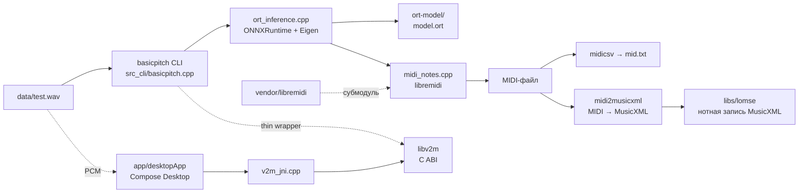

# v2m — индекс проекта

Индекс рабочей области `v2m` (аудио → MIDI-транскрипция). Дата генерации: 2026-08-29.

## Назначение

Рабочая область для транскрипции аудио в MIDI при помощи C++-порта нейросети
Spotify Basic Pitch ([basicpitch.cpp](https://github.com/sevagh/basicpitch.cpp)).
Аудио-вход (`data/test.wav`) обрабатывается CLI-приложением `basicpitch` (ONNXRuntime + Eigen),
результат записывается в MIDI. Справочные MIDI-файлы (Muse — «New Born») служат
эталоном для сравнения; `data/mid.txt` — выгрузка MIDI-событий в формате midicsv для инспекции.

## Структура

```text
v2m/
├── CLAUDE.md                          # инструкции для Claude Code (этот проект)
├── INDEX.md                           # этот файл — индекс рабочей области
├── README.md                          # команды, принципы обработки, ручки CLI, примеры (подвал — лист регистрации изменений)
├── docs/                              # документация проекта
│   ├── history.md                     # ход работ по датам (журнал; отчёт по ритму)
│   ├── brd.md                         # требования Р1-Р3, Т01 (подвал — журнал изменений)
│   ├── open_questions.md              # ручки-кандидаты, вопросы OQ-NN (журнал)
│   └── backlog.md                     # отложенные задачи OQ-NN (тембр, громкость, моно/поли, гармонизация, ритмизация)
├── basicpitch/                        # код (перенесён из data/ 2026-08-29)
│   ├── src/
│   │   └── basicpitch.cpp/            # клон sevagh/basicpitch.cpp (git, с субмодулями)
│   │       ├── src/                   # общий код инференса и создания MIDI
│   │       │   ├── basicpitch.hpp     # заголовочный файл API + ModelParams (ручки)
│   │       │   ├── ort_inference.cpp  # инференс ONNXRuntime
│   │       │   └── midi_notes.cpp     # конвертация нот в MIDI (libremidi)
│   │       ├── src_cli/               # Linux CLI (CMakeLists.txt, basicpitch.cpp)
│   │       ├── src_wasm/              # функция WASM для веб-демо
│   │       ├── ort-model/             # модель: model.onnx, model.ort, model.with_runtime_opt.ort
│   │       │   └── model/             # сгенерированные веса: model.ort.c, model.ort.h
│   │       ├── scripts/               # сборка ORT-модели, python-инференс
│   │       ├── vendor/                # субмодули: basic-pitch v0.4.0, eigen, libnyquist,
│   │       │                          #   libremidi v4.5.0, onnxruntime, oboe-resampler
│   │       └── web/                   # веб-демо (app.js, basicpitch.js)
│   ├── src/midi2musicxml/             # наш конвертер MIDI → MusicXML (C++17, без зависимостей; 2026-08-30)
│   ├── src/libv2m/                    # C-библиотека: v2m.h, libv2m.cpp, v2m_jni.cpp (JNI), build/libv2m.so
│   ├── build/                         # сборочный каталог CMake (Unix Makefiles, Release)
│   │   └── basicpitch                 # собранный CLI-бинарник (~2.7 МБ, ELF x86-64)
│   ├── input/                         # входные файлы (пусто)
│   └── output/                        # выходные файлы (пусто)
├── libs/                              # клоны библиотек-кандидатов (эксперименты; в .gitignore)
│   ├── lomse/                         # lenmus/lomse — движок нотной записи (отложен, 2026-08-30)
│   └── verovio/                        # verovio — рендер нот в SVG (MusicXML/MEI; отложен, 2026-08-31)
├── app/                               # Kotlin-приложение (KMP: shared + desktopApp, Compose Desktop; 2026-08-30)
└── data/                              # музыка и данные экспериментов
    ├── mid.txt                        # MIDI-события в формате midicsv (для инспекции)
    ├── test.wav                       # аудио-вход для транскрипции
    ├── test.mid, muse4.mid            # результаты/промежуточные MIDI
    ├── Muse — New Born *.mid (6 файлов)   # эталонные транскрипции (MIDIfind.com)
    └── bin/, build/, output/          # пустые (резерв). !ai
```

## Карта компонентов



## Рабочий процесс

1. Аудио-файл (WAV) подаётся в CLI: `basicpitch/build/basicpitch <wav> <out dir> [options]`.
2. `ort_inference.cpp` выполняет инференс нейросети (модель `ort-model/model.ort`, веса в `.c/.h` встроены в бинарник).
3. `midi_notes.cpp` формирует MIDI-события через libremidi (ручки — см. `README.md`); результат — `.mid`-файл в каталоге вывода.
4. Для сравнения с эталоном события выгружаются в `mid.txt` (формат midicsv).

## Ключевые файлы

| Путь | Роль |
|---|---|
| `basicpitch/src/basicpitch.cpp/src_cli/CMakeLists.txt` | сборочный скрипт CLI (источник конфигурации `build/`) |
| `basicpitch/src/basicpitch.cpp/src/basicpitch.hpp` | API + struct `ModelParams` (ручки, дефолты) |
| `basicpitch/src/basicpitch.cpp/ort-model/` | модель в форматах ONNX/ORT и сгенерированные веса |
| `basicpitch/build/basicpitch` | собранный бинарник CLI (работает автономно) |
| `data/mid.txt` | текстовое представление MIDI-событий (midicsv) |
| `data/test.wav` | аудио-вход |
| `data/Muse — New Born [MIDIfind.com].mid` и др. | эталонные MIDI для сравнения |

## Примечания

- 2026-08-29: реструктуризация — код в `basicpitch/`, музыка и данные в `data/`, документация в `docs/`. Удалён дубль `libs/libremidi` (копия `vendor/libremidi`); удалены устаревшие сборочные каталоги.
- 2026-08-30: заведён `libs/` — внешние исходники библиотек (эксперименты); клонирован `lomse` (lenmus/lomse, движок нотной записи; читает MusicXML/LMD/MNX, MIDI напрямую не импортирует).
- 2026-08-31: в `libs/` перенесён `verovio` (клон из корня; headless-рендер нот в SVG); оба — кандидаты на рендер нот, отложены (рабочий путь — MuseScore); в репозиторий не включаются (`.gitignore`).
- Сборочный каталог `basicpitch/build` переконфигурирован после реструктуризации (свежая сборка).
- Собранный бинарник `basicpitch/build/basicpitch` автономен (веса модели встроены) и работает независимо от переконфигурации.
- `data/bin/`, `data/build/`, `data/output/` пусты — зарезервированы. !ai
